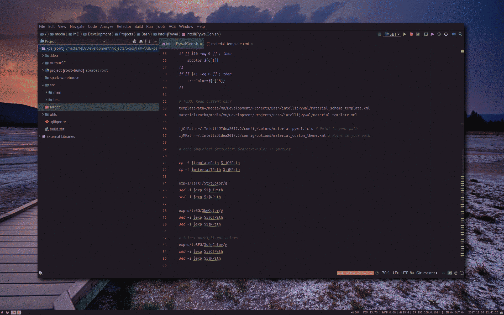

# Pywal Intellij Material Theme and Scheme Generator
The script in this repository can generate Intellij themes based on
[Pywal](https://github.com/dylanaraps/pywal) or other color scheme generator tools automatically. It is meant to
be used in combination with [Material Theme Plugin](https://plugins.jetbrains.com/plugin/8006-material-theme-ui) to integrate with every
element of Intellij's UI instead of just the editor's color scheme.

## Dependencies
- Intellij (or some other Jetbrains IDE) + Material Theme Plugin
- Pywal

## Instalation

   >**Warning**: this script overrides `material_custom_theme.xml` so be sure to backup your custom material theme configuration if you care for it.

1. Clone or download the files in this repository
2. Run `intellijPywalGen.sh` and make sure to pass the path to your [config
directory](https://intellij-support.jetbrains.com/hc/en-us/articles/206544519-Directories-used-by-the-IDE-to-store-settings-caches-plugins-and-logs) (eg.: `./intellijPywalGen.sh $HOME/.IntelliJIdea2018.1/config`)
3. Set material theme to "custom theme" `(Intellij -> Tools -> Material Theme ->
   Material Theme Chooser -> Custom Theme)`
4. Import `material-pywal.icls` editor scheme which should be located in your
   config/colors folder via `(Intellij -> File -> Settings -> Editor
   -> Color Scheme -> Scheme : -> Import Scheme...)`
5. Set the editor's color scheme `(Intellij -> File -> Settings -> Editor
   -> Color Scheme -> Scheme: Material Pywal)`
6. Restart Intellij

After the first time you'll only need to restart Intellij after you run the script in order for changes to
take effect.

#### Mac

If you use `intellijPywalGen.sh`, you will [get error about sed](https://stackoverflow.com/questions/4247068/sed-command-with-i-option-failing-on-mac-but-works-on-linux).
Therefore, you can use `intellijPywalGenmac.sh` instead.

The following is an example code, when CLion2020.1 in mac.

```
./intellijPywalGenmac.sh $HOME/Library/ApplicationSupport/JetBrains/CLion2020.1
```

## i3wm Integration
Integration with `i3` is very simple. A good way to go about it is to bind
a shortcut to set a random wallpaper using pywal and then chain a call to this script on the same
command to make sure pywal has updated the colors:

    bindsym $mod+Print exec "wal -i $HOME/Pictures/Wallpapers;/pathToScript/intellijPywalGen.sh  $HOME/.IntelliJIdea2018.1/config"

Notice both commands are separated by a semicolon without any space in-between
and the params are passed with an unescaped space.

## Screenshots

